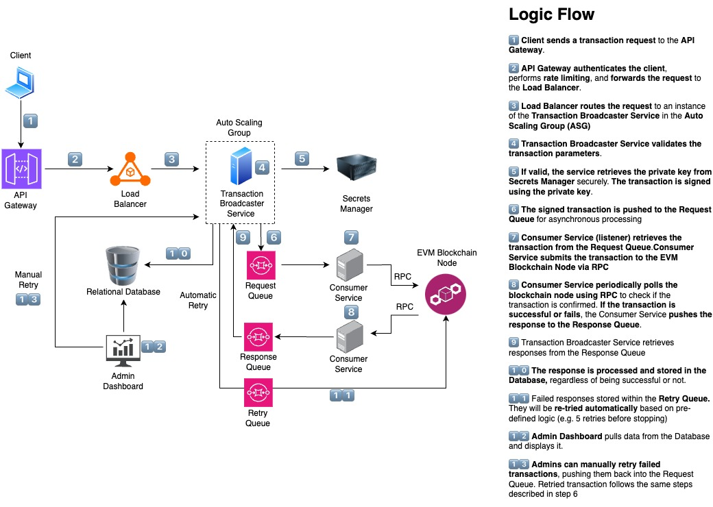

# Transaction Broadcaster Service Design

## **Overview**

The transaction broadcaster service is responsible for signing and broadcasting transactions to an EVM-compatible blockchain network. It ensures robustness through automatic retries, transaction persistence, and admin controls. This document details the software architecture and workflow for implementing this service.

## **System Architecture**

## **Components**

- **API Gateway**: Handles incoming requests and routes them to the broadcaster service. It ensures secure authentication and authorization before routing to the service.
- **Load Balancer**: Directs requests to the least busy broadcaster instance, improving performance and lowering latency.
- **Transaction Broadcaster Service**: Signs transactions, manages broadcasting logic, and retries failed transactions. It is set up with auto-scaling to scale up or down accordingly.
- **Message Queues**:
  - **Request Queue**: Handles asynchronous transaction broadcasting requests.
  - **Response Queue**: Handles responses from the blockchain network.
  - **Retry Queue**: Stores failed transactions for later retries.
- **EVM-compatible Blockchain Node**: Receives signed transactions via RPC calls.
- **Relational Database**: Stores transaction logs, status, and retry information.
- **Admin Dashboard**: Allows manual intervention and transaction monitoring.

## **High-Level Flow**

1. The API Gateway receives a `POST /transaction/broadcast` request.
2. The Load Balancer directs the request to an available broadcaster instance.
3. The Broadcaster Service extracts data from the request and signs it.
4. The signed transaction is added to the Request Queue.
5. The Consumer Service retrieves the transaction from the Request Queue and submits it to the Blockchain Node via RPC.
6. The Response Queue receives the transaction response asynchronously.
7. If successful, the service updates the Database and marks the transaction as `Success`.
8. If the transaction fails, it is logged as `Failed` and retried using the Request Queue again. After a certain number of failed retries, it will be moved to the Retry Queue (Dead Letter Queue).
9. The Admin Dashboard allows monitoring and manual retries of failed transactions.
